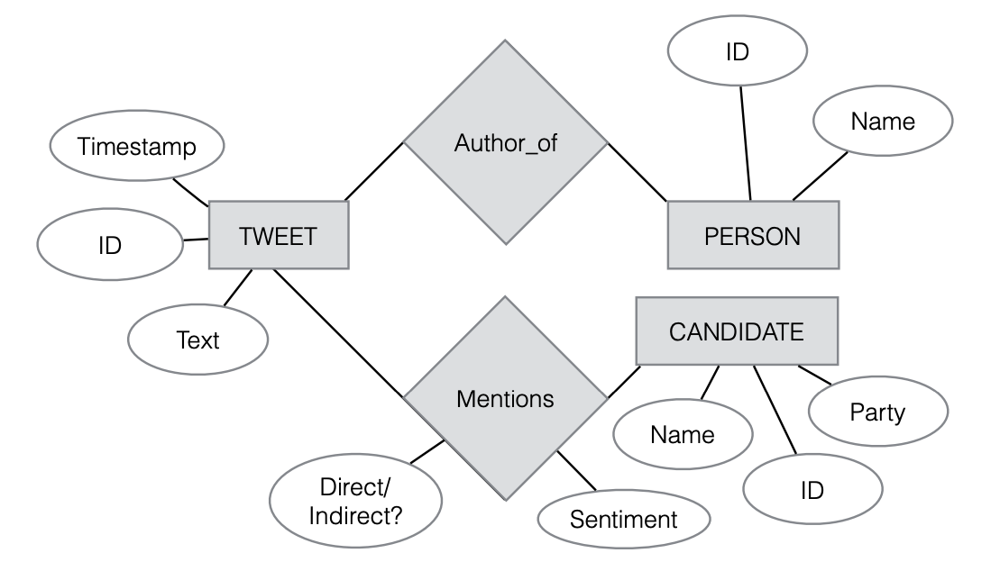

## SQL tutorial

The following contents are from [cs1951A](https://cs.brown.edu/courses/csci1951-a/slides/) and [w3school](https://www.w3schools.com/sql/)

SQL slides: [Slides](https://cs.brown.edu/courses/csci1951-a/slides/files/2019-01-31-lecture2-sql1.pdf)
SQL assigment: [Assignment](https://cs.brown.edu/courses/csci1951-a/assignments/sql.html)

### Basic concepts

- [Data definition language](https://en.wikipedia.org/wiki/Data_definition_language): Define types and relation
- Data [Manipulation](https://en.wikipedia.org/wiki/Data_manipulation_language) and [Query](https://en.wikipedia.org/wiki/Query_language) language

**basic logic: create a table or multiple and play with them.**

### Data types

Reference: [SQL data types](https://www.journaldev.com/16774/sql-data-types)


*https://www.journaldev.com/16774/sql-data-types*

### Examples


*https://twitter.com/yezhengSTAT*


*brown cs1951A*

## SQLite3 in Python

The following tutorial follows [sqlite3](https://docs.python.org/3/library/sqlite3.html) 
If you know a more popular one, just let me know :)

### Start connect to sqlite3 server

[Documentation](https://docs.python.org/3/library/sqlite3.html)

Python is an object-oriented language [OOP](https://en.wikipedia.org/wiki/Object-oriented_programming), you should learn the basic concept for this term.

To run our `sqlite3`, you need to first connect to a local/remote database via `.connect(NAME)`

Once you have a [Connection](https://docs.python.org/3/library/sqlite3.html#sqlite3.Connection), you can create a [Cursor](https://docs.python.org/3/library/sqlite3.html#sqlite3.Cursor) object and call its [execute()](https://docs.python.org/3/library/sqlite3.html#sqlite3.Cursor.execute) method to perform SQL commands

```Python
# Python3

conn = sqlite3.connect(NAME)
cursor_obj = conn.cursor()
cursor_obj.execute(SQL_COMMAND)
```

### Create a TABLE

To create a `SQL TABLE`, first you need to [CREAT TABLE](https://www.w3schools.com/sql/sql_create_table.asp), also declare columns' name and type

```sql
--SQLite3

CREATE TABLE table_name (
    column1 datatype,
    column2 datatype,
    column3 datatype,
   ....
);
```

In Python, if you want to run a sql command, you need to pass a string to `cursor.execute(SQL_COMMAND: string)`

```python
# Python3

command = """
CREATE TABLE table_name (
    column1 datatype,
    column2 datatype,
    column3 datatype,
   ....
);
"""
cursor_obj.execute(command)
```

### Show tables in current database

To show tables, in sqlite3 console you can use `.tables`, more command from `.help`

```sql
--SQLite3

.tables
```

or 

```sql
--SQLite3

SELECT name FROM sqlite_master WHERE type='table';
```

Here the `SELECT` command is select object from database, once you executing a `SELECT` statement. 

Equivalent, in python, we can do

```python
# Python3

command = "SELECT name FROM sqlite_master WHERE type='table';"
cursor_obj.execute(command)
print(cursor_obj.fetchall())
```

You can either treat the cursor as an [iterator](https://docs.python.org/3/glossary.html#term-iterator), call the cursor’s [fetchone()](https://docs.python.org/3/library/sqlite3.html#sqlite3.Cursor.fetchone) method to retrieve a single matching row, or call [fetchall()](https://docs.python.org/3/library/sqlite3.html#sqlite3.Cursor.fetchall) to get a list of the matching rows.

### Insert one record in database

Once we create our base table, we can start insert records into the database.

In sqlite3, it is possible to write the `INSERT INTO` statement in two ways.

The first way specifies both the column names and the values to be inserted:

```sql
--SQLite3

INSERT INTO table_name (column1, column2, column3, ...)
VALUES (value1, value2, value3, ...);
```

or 

```sql
--SQLite3

INSERT INTO table_name
VALUES (value1, value2, value3, ...);
```

## Relational database

Different [Key types](https://www.dotnettricks.com/learn/sqlserver/different-types-of-sql-keys)

[**Primary key**](https://www.w3schools.com/sql/sql_primarykey.asp) is a set of one or more fields/columns of a table that uniquely identify a record in database table. It can not accept null, duplicate values. Only one Candidate Key can be Primary Key.

[**Foreign key**](https://www.w3schools.com/sql/sql_foreignkey.asp) is a field in database table that is Primary key in another table. It can accept multiple null, duplicate values. For more help refer the article [Difference between primary key and foreign key](http://www.dotnettricks.com/learn/sqlserver/difference-between-primary-key-and-foreign-key).

**Consider if you are hiring by amazon, how did you manage amazon data? how many tables do you need, how to link them together?**

```sql
--SQLite3

CREATE TABLE Customers (
    CustomerID INT PRIMARY KEY,
    Name VARCHAR(1000)
);

CREATE TABLE Products (
    ProductID INT PRIMARY KEY,
    price NUMERIC,
    original VARCHAR(1000)
);

CREATE TABLE Orders (
    OrderID INT PRIMARY KEY,
    size INT,
    CustomerID INT, 
    ProductID INT, 
    FOREIGN KEY (CustomerID) REFERENCES Customers(CustomerID),
    FOREIGN KEY (ProductID) REFERENCES Products(ProductID)
);
```

### Why?

Link TABLES together!

### Practice

In the [Assignment](https://cs.brown.edu/courses/csci1951-a/assignments/sql.html), there is a database named people.db, with the name, age, ID, and occupation of some students. Here we can create these three tables by ourself.

```
people_main(ID INTEGER, name TEXT, occupation TEXT, age INTEGER)
people_likes(ID1 INTEGER, ID2 INTEGER)
people_friends(ID1 INTEGER, ID2 INTEGER)
```

1. Create table `people_main`, `people_likes` and `people_friends`.
2. Consider what is the primary key in `people_main`.


The table `people_likes`, based on following roles:

1. ID1 and ID2 should from people_main table
2. ID1 likes the person with ID2
3. Suppose each person can only like one person

**Should we have a key/keys for this table? If so, what type of key/keys?**

`people_friends` should based on:

1. ID1 and ID2 should from people_main table
2. ID1 != ID2
3. If person with ID1 is friend with ID2, the revers should also be true

**How about people_friends?**

[Practice](../assets/python/sql.zip)
